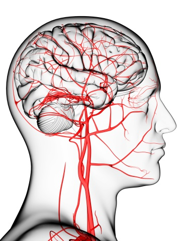

## Braining Mini-Challenge: Predicting Stroke Risk Based on Lifestyle Habits
<p align="center">
  
</p>

#### This project tackles the Braining Mini-Challenge, which aims to predict the risk of stroke based on key lifestyle and health variables. By exploring patterns in age, BMI, sleep, smoking, and exercise, the project demonstrates the application of Exploratory Data Analysis (EDA), statistical methods, and machine learning models in a health prediction context.

### Project Structure

```text
Braining-Mini-Challenge-Stroke-Risk
│
├── data                -> Dataset
│   └── I05-0006_stroke_risk.csv
│
├── notebooks           -> Jupyter notebooks for exploration
│   ├── eda.ipynb
│   ├── main.ipynb
│   └── experiments.ipynb
│
├── python_files        -> Python scripts for reproducibility
│   ├── eda.py
│   ├── main.py
│   └── experiments.py
│
├── report              -> Final project report
│   └── report.pdf
│
└── README.md           -> Project documentation
```

### Workflow

[Exploratory Data Analysis](notebooks/eda.ipynb) -> [Feature Engineering](notebooks/main.ipynb) -> [Model Training and Evaluation](notebooks/main.ipynb) -> [Documentation](report/report.pdf)

### Installation
Clone the repository and install dependencies:
```text
git clone https://github.com/Oguama77/Braining_Mini_Challenge.git
cd Braining-Mini-Challenge-Stroke-Risk
pip install -r requirements.txt
```